# Vietnam Influencer Campaign Analysis

## Project Overview

This project analyzes Vietnam influencer marketplace data to help brands identify creators based on content relevance, audience performance, estimated price, cost efficiency, and campaign objectives.

Unlike projects that only rank creators by follower count, this analysis combines:

- Creator scale and performance
- Estimated booking price and cost per view
- Field tags and video-content tags
- Content-category segmentation
- Campaign-oriented creator recommendations

The dataset was collected by the author using a custom Selenium crawler from publicly visible creator marketplace pages. The project covers the full data workflow from collection and cleaning to EDA, SQL analysis, and an interactive Power BI dashboard.

> **Important:** The dataset does not contain actual campaign revenue, conversions, or ROI. Commerce Score is treated only as an indicator of commercial potential.

---

## Business Questions

This project aims to answer:

1. What does the Vietnam influencer market look like by creator size and price tier?
2. Is follower count sufficient to evaluate creator performance?
3. Which creator segments and content categories provide better cost efficiency?
4. Which creators are suitable for awareness, collaboration, commerce-potential, or budget-focused campaigns?
5. How can brands shortlist creators by combining category relevance, views, engagement, price, and platform scores?

---

## Data Collection

### Source

Creator information was collected from publicly visible creator marketplace pages.

### Collection Method

- Custom Selenium crawler using Firefox
- Incremental saving to reduce data loss during long crawling sessions
- Creator ID used as the primary identifier
- Duplicate checks performed during cleaning
- No cookies, login tokens, passwords, or private credentials are included in this repository

### Raw Dataset

- Raw rows: **2,438**
- Unique creator IDs: **1,149**
- Duplicate rows by creator ID: **1,289**
- Duplicate rate: **52.87%**

The duplicate issue was handled by converting the dataset into a one-row-per-creator structure.

> Before publishing raw scraped data, verify the source platform's terms and remove any unnecessary or sensitive fields.

---

## Dataset Features

| Feature | Description |
|---|---|
| `id` | Unique creator identifier |
| `name` | Creator display name |
| `followers_num` | Normalized follower count |
| `median_views_num` | Median views of recent content |
| `engagement_pct` | Engagement rate |
| `price_num` | Estimated booking price in VND |
| `collab_score` | Platform collaboration score |
| `broadcast_score` | Platform broadcast/reach score |
| `commerce_score` | Platform commerce-potential score |
| `field_tags` | Creator field or industry tags |
| `video_tags` | Video-content tags |
| `cpv` | Estimated price divided by median views |
| `view_rate_pct` | Median views divided by followers |
| `creator_segment` | Micro, Mid-tier, Macro, or Mega |
| `price_tier` | Low, Medium, High, or Premium |
| `potential_group` | Rule-based campaign-potential group |

---

## Data Cleaning and Feature Engineering

The cleaning notebook performs the following tasks:

1. Audits schema, data types, missing values, and duplicates
2. Standardizes column names
3. Converts follower, view, engagement, and price strings into numeric values
4. Aggregates duplicate creator IDs into one creator record
5. Combines unique field and video tags
6. Creates business metrics and segmentation features
7. Exports the cleaned dataset for SQL and Power BI

### Engineered Metrics

```text
CPV = Estimated Price / Median Views

View Rate (%) = Median Views / Followers × 100
```

### Rule-based Segmentation

Creators were grouped into business-oriented categories such as:

- Awareness Booster
- Cost-efficient
- Collab-ready
- All-round Potential
- Commerce / Sales Potential
- High Reach - Low Efficiency
- General / Low Priority

These groups are decision-support segments, not machine-learning predictions.

---

## Data Quality Findings

| Data-quality issue | Result |
|---|---:|
| Commerce Score missing | 87.12% |
| Field Tags missing | 54.92% |
| Broadcast Score missing | 25.15% |
| Collab Score missing | 0.96% |

Because Commerce Score has low coverage, commerce-related conclusions are presented together with coverage information and should not be interpreted as actual sales performance.

The creator-segment distribution is also highly imbalanced:

| Creator Segment | Creators |
|---|---:|
| Mega | 656 |
| Macro | 346 |
| Mid-tier | 146 |
| Micro | 1 |

The single Micro creator should not be treated as representative of the broader Micro-influencer market.

---

## Exploratory Data Analysis

### Market KPIs

| Metric | Result |
|---|---:|
| Unique creators | 1,149 |
| Aggregated followers | 2.03B |
| Average median views | 299.31K |
| Average engagement | 7.04% |
| Median estimated price | 7.00M VND |
| Median CPV | 45.02 VND/view |

> Aggregated followers are the sum of creator follower counts and do not represent unique audience reach.

### Creator Segment Distribution

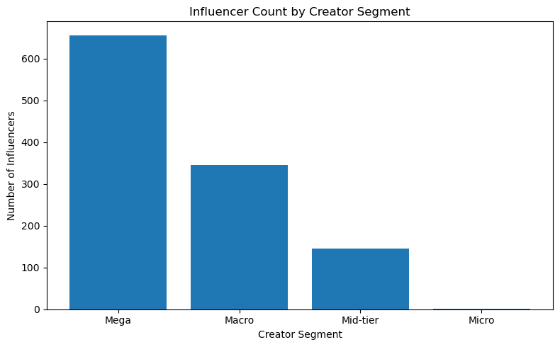

The market is dominated by Mega and Macro creators, while the Micro segment contains only one creator in this dataset.

### Followers vs Median Views

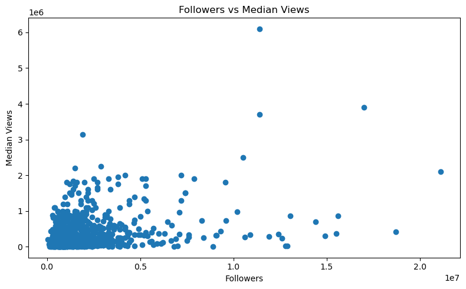

Follower count and median views have only a moderate relationship. The correlation between them is approximately **0.38**, supporting the conclusion that follower count alone is not sufficient for creator selection.

### Estimated Price vs Median Views

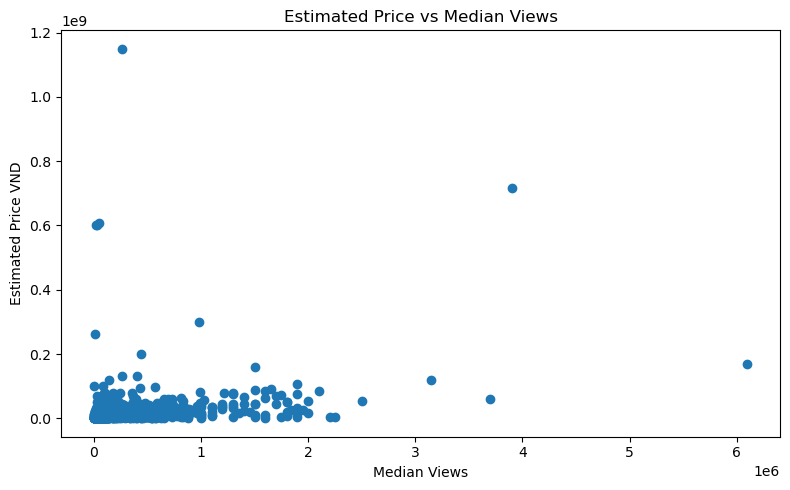

Creators with similar median views may have very different estimated prices. CPV is therefore used to identify more cost-efficient candidates.

### Campaign Potential Groups

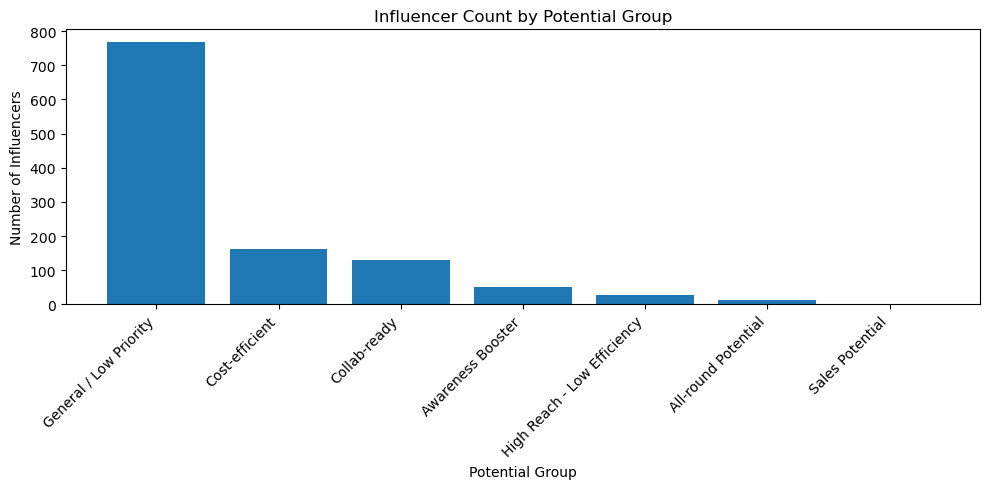

Most creators fall into the General / Low Priority group. Cost-efficient and Collab-ready creators form the largest actionable segments, while Sales Potential is limited because Commerce Score is missing for most creators.

### Top Video Tags

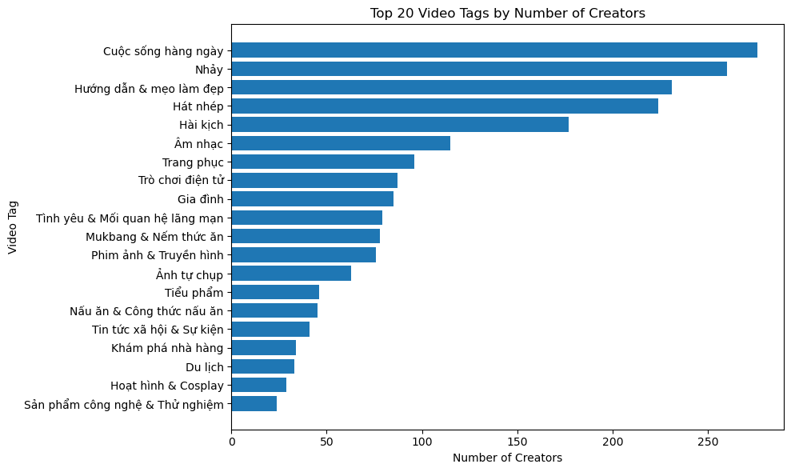

Popular content themes include daily life, dance, beauty tips, lip-sync, comedy, music, fashion, gaming, and family-related content.

### Creator Count by Content Category

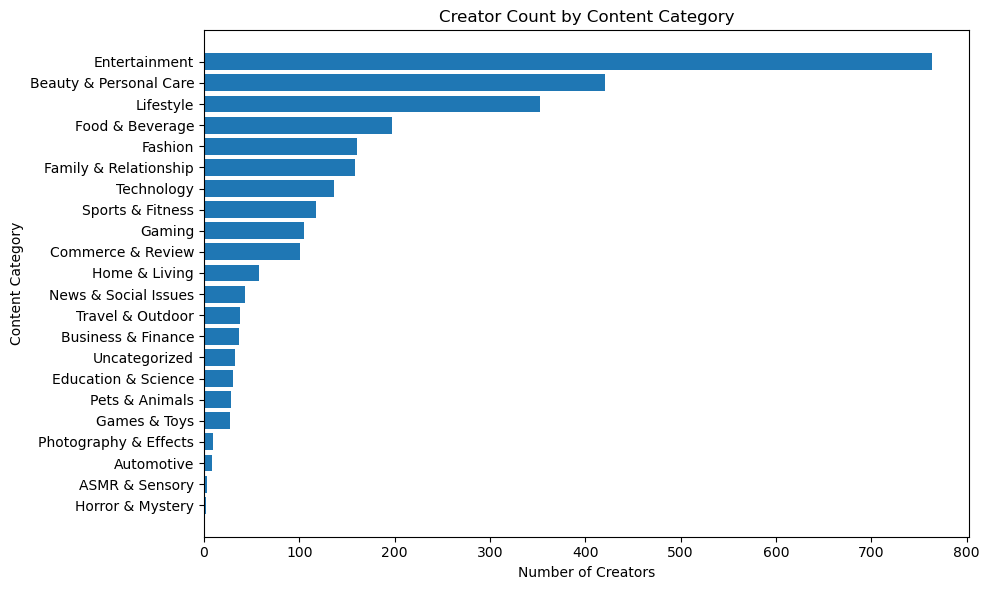

Top categories include:

| Content Category | Unique creators |
|---|---:|
| Entertainment | 764 |
| Beauty & Personal Care | 421 |
| Lifestyle | 353 |
| Food & Beverage | 197 |
| Fashion | 161 |
| Family & Relationship | 158 |
| Technology | 136 |
| Sports & Fitness | 118 |

A creator can belong to multiple categories, so category totals do not sum to the total number of unique creators.

<details>
<summary><strong>Additional EDA visuals</strong></summary>

### Median CPV by Content Category

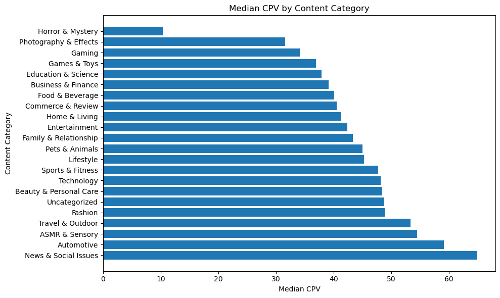

### Correlation Matrix

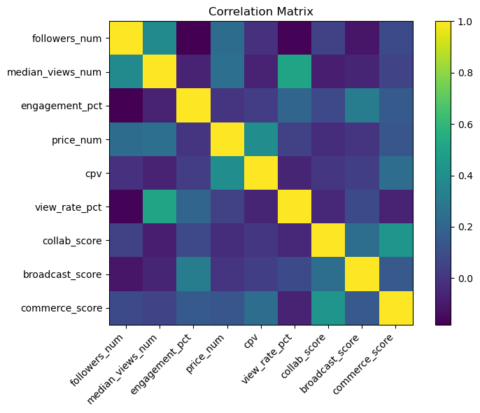

</details>

---

## SQL Analysis

The cleaned tables are designed for business-oriented SQL queries, including:

- Market KPI validation
- Creator-segment performance
- Price-tier distribution
- Potential-group distribution
- Category-level engagement and CPV
- Top cost-efficient creators
- Top awareness creators
- Top creators within each content category
- Missing-score coverage analysis

Recommended tables:

```text
influencers_cleaned
creator_content_category
creator_video_tags
creator_field_tags
```

Relationship:

```text
influencers_cleaned.id 1 ─── * creator_content_category.id
```

---

## Power BI Dashboard

The Power BI report contains five pages:

1. **Market Overview**
2. **Creator Performance Segmentation**
3. **Content Category Segmentation**
4. **Cost Efficiency Analysis**
5. **Campaign Recommendation**

### 1. Market Overview

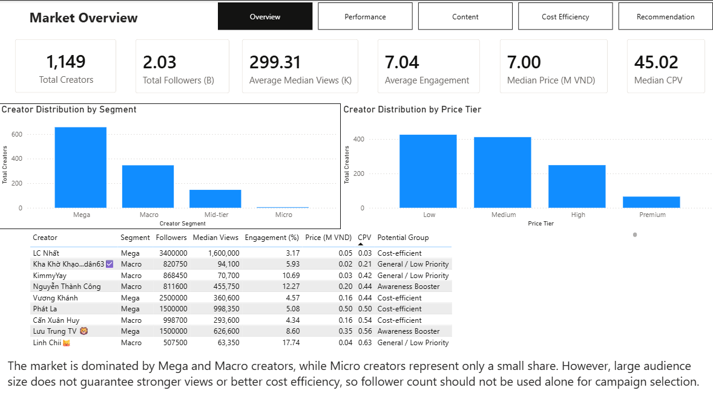

### 2. Creator Performance Segmentation

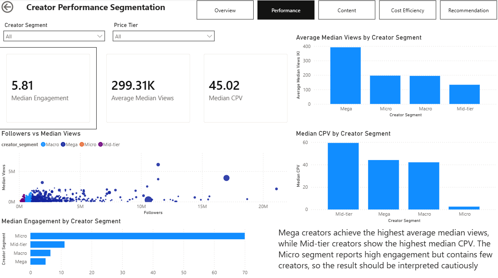

### 3. Content Category Segmentation

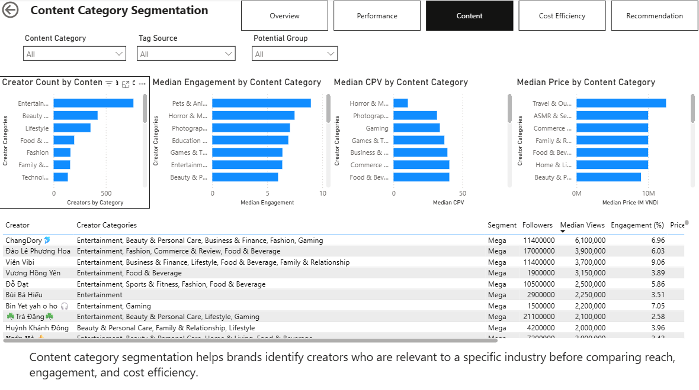

### 4. Cost Efficiency Analysis

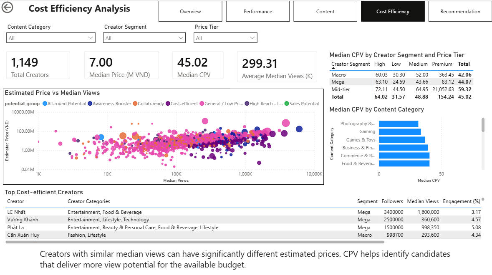

### 5. Campaign Recommendation

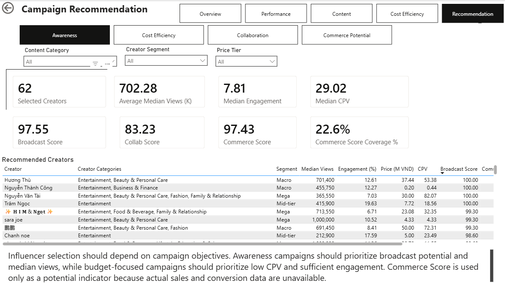

The recommendation page uses bookmarks to switch among:

- Awareness
- Cost Efficiency
- Collaboration
- Commerce Potential

---

## Main Findings

1. **Follower count alone is not enough.**  
   Creators with similar follower counts can have very different median views, engagement, and prices.

2. **The market is concentrated in larger creators.**  
   Mega and Macro creators account for most of the dataset, while the Micro segment is underrepresented.

3. **Cost efficiency varies substantially.**  
   Creators with similar median views may have very different estimated prices, making CPV useful for budget-focused shortlisting.

4. **Content relevance should come before ranking.**  
   Brands can filter creators by category, then compare views, engagement, estimated price, CPV, and campaign-potential scores.

5. **Commerce conclusions are limited.**  
   Commerce Score is available for only a minority of creators and is not actual sales, conversion, or ROI data.

---

## Project Structure

```text
Vietnam_Influencer_Campaign_Analysis/
│
├── data/
│   ├── raw/
│   │   └── new3.csv
│   └── cleaned/
│       ├── influencers_cleaned.csv
│       ├── creator_content_category.csv
│       ├── creator_video_tags.csv
│       ├── creator_field_tags.csv
│       └── unmapped_other_tags.csv
│
├── notebooks/
│   ├── 01_data_understanding_cleaning.ipynb
│   ├── 02_eda_visualization_insights.ipynb
│   └── 03_tag_segmentation_analysis.ipynb
│
├── sql/
│   └── influencer_analysis.sql
│
├── powerbi/
│   └── Vietnam_Influencer_Campaign_Analysis.pbix
│
├── assets/
│   ├── eda/
│   └── dashboard/
│
├── requirements.txt
└── README.md
```

---

## How to Reproduce

1. Place the raw CSV in `data/raw/`.
2. Run the notebooks in order:

```text
01_data_understanding_cleaning.ipynb
02_eda_visualization_insights.ipynb
03_tag_segmentation_analysis.ipynb
```

3. Import the cleaned CSV files into the SQL database.
4. Run the SQL analysis queries.
5. Import `influencers_cleaned.csv` and `creator_content_category.csv` into Power BI.
6. Create the one-to-many relationship using creator ID.
7. Open or rebuild the five dashboard pages.

Suggested Python packages:

```text
pandas
numpy
matplotlib
jupyter
selenium
```

---

## Limitations

- The data is a snapshot of publicly visible marketplace information.
- Estimated prices may not match final negotiated campaign prices.
- Total followers do not represent unique audience reach.
- Commerce Score is a platform-provided potential indicator, not actual sales.
- Actual conversion, revenue, ROI, audience demographics, and campaign outcomes are unavailable.
- A creator may belong to multiple content categories.
- Tag-to-category mapping is rule-based and may require future refinement.
- Some segments and category-price combinations contain very small samples.
- Very low prices and CPV outliers should be validated against the raw source before business use.

---

## Tools

- **Python / Pandas:** Data cleaning, feature engineering, and EDA
- **Selenium:** Data collection
- **SQL:** Business analysis queries
- **Power BI:** Interactive dashboard and recommendation workflow
- **Git / GitHub:** Version control and portfolio presentation

---


